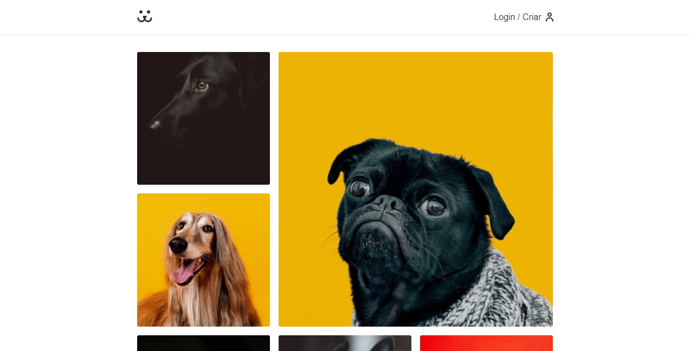

<h1 align="center">
    
</h1>

  
   
  

  

  

  <a href="#-sobre-o-projeto">Sobre o projeto</a>&nbsp;&nbsp;&nbsp;|&nbsp;&nbsp;&nbsp;
  <a href="#-tecnologias">Tecnologias</a>&nbsp;&nbsp;&nbsp;|&nbsp;&nbsp;&nbsp;
  <a href="#-projeto-final">Projeto final</a>

 

  

## 💻 Sobre o projeto

Aplicação desenvolvida para obtenção do certificado de conclusão do curso de **React Completo**, da [Origamid](https://www.origamid.com/curso/react-completo).

Trata-se de uma rede social baseada no Instagram, mas com a postagem de fotos voltada para cachorros.

## 🚀 Tecnologias

Esse projeto foi desenvolvido com as seguintes tecnologias:

- [React](https://reactjs.org/docs/getting-started.html)
- [React Router Dom](https://reactrouter.com/web/guides/quick-start)
- [Victory](https://formidable.com/open-source/victory/docs)

## 🌐 Projeto final
[Clique aqui](https://vilsonsampaio-dogs.netlify.app/) para acessar o projeto no ar!

---

  Feito com 🖤 <a href="https://www.linkedin.com/in/vilsonsampaio/">Vilson Sampaio</a>

